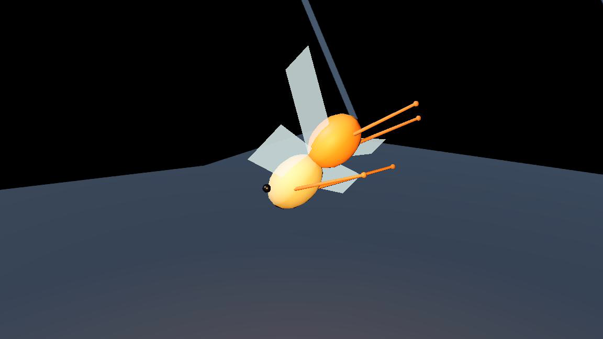
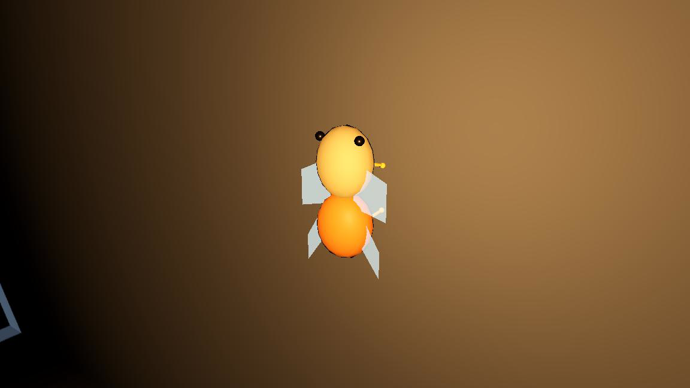
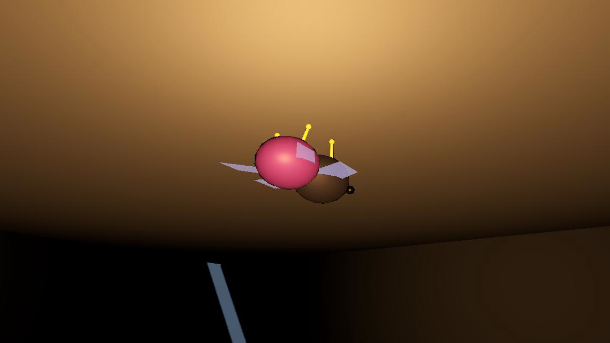

# Cicada 3D 控制器

`CicadaLocomotionController` 是与 `LizardLocomotionController` 并列的物种后端。两者共享
`BodyChunk` / `ChunkConnection` / `Body` / `ITerrainQuery`，但不共享 locomotion 状态机：
蜥蜴靠腿的抓地反馈推进，蝉则直接向两节身体注入差分升力、阻尼和方向推力。

实现依据为本机 Rain World `Cicada` / `CicadaGraphics` 的反编译研究，只移植行为结构与
单位关系，不包含原游戏源码。

## 身体与动画边界

- 身体固定为前体、后体两个球形 chunk 和一条刚性连接。默认半径约
  `0.1875m / 0.175m`，连接长 `0.35m`（`1px = 0.025m`）。
- `CicadaParams` 在工厂装配时冻结为实例私有快照；外部随后修改原参数对象不会改变存量蝉。
  `BodyMass` 会换算为该实例的飞行动力响应，因此 dark 的较大体重确实带来更迟缓的加速。
- 四片翅膀与四条触须是固定 tick 的程序化表现状态，不产生身体升力，也不计入支撑或推进。
- 完整 3D 姿态由核心输出 `Forward / Up / Right`；`Basis`、材质和网格只存在于 Godot
  renderer。核心仍只依赖 `Vector3` / `Mathf`。
- 原版自由飞行不消耗 stamina；首版不把它改造成飞行燃料。抓取、搬运和动态对象粘附另行接线。

## 宿主接口

```csharp
CicadaParams p = CicadaFactory.Light(); // 或 Dark / ByName
CicadaLocomotionController cicada =
    CicadaFactory.CreateController(origin, Vector3.Forward, p);

cicada.MoveDir = desiredDirection.Normalized(); // 完整 3D 方向
cicada.RunSpeed = 1f;
cicada.Tick(new TickContext(gravityPerTick, terrain, tick));
```

- `MoveTarget`：可选的完整 3D 飞行路径点；到点后 `AtMoveTarget=true`，弱位置保持仍会抑制漂移。
- `RequestPerch(TerrainHit)`：显式选择停驻表面。零法线（HitFromInside）会被拒绝；地板、墙和
  天花板统一保存为点、法线和切向前向。
- `TakeOff(direction)` / `TryStartCharge(direction)`：显式起飞与蓄力冲撞。
- `Shift`：随世界 rebase，保留状态并平移所有世界坐标记忆。
- `Teleport` / `Launch`：清停驻、目标和 Charge；后者再向所有 chunk 注入统一冲量。

## 状态与固定序

- `Mode`：`Flying / Landing / Perched / Stunned`。
- `ChargePhase`：`None / Windup / Dash`，方向在开始时锁定。
- 一个 controller tick 先按上一轮状态执行 `Body.Tick`，再读取本 tick 接触、更新模式，并向
  chunk 注入下一 tick 使用的飞行动力。这对应 RW 的 `base.Update` 后执行 Cicada 行为块。
- `FlightPower` 出生为 0，飞行时以 0.1 趋近 1，停驻时以 0.05 衰减；起飞直接置 0.5。
- 停驻表面每 tick 通过短法线射线验证；表面消失就复飞。停驻后持续给移动意图 30 tick 也会起飞。
- 停驻收敛同时要求 `Up` 对齐表面外法线，使 `Forward / Right` 均留在切平面；收翼和触须末端
  都有同平面约束，不会在侧墙或顶面稳定态穿面。
- Charge 按计数推进：2–20 蓄力后缩、21 切换、22–38 冲刺、39 结束。低速地形撞击反射续冲，
  高速撞击取消并连续进入 20 tick `Stunned`。

## 沙盒与回归

- `scenes/cicada_sandbox.tscn`：独立白盒，不改蜥蜴沙盒；默认装配 `light`，可切 `dark`。
- `core/cicada_smoke/`：无引擎双跑、拓扑、3D 飞行、姿态、停驻、起飞、Charge 与生命周期回归。
- `tools/run_cicada_matrix.sh`：Godot 40/400Hz、微扰、墙/顶停驻、起飞和撞墙矩阵。

## 正常渲染验收

以下画面由 Godot Metal Forward+ 正常渲染器沿确定性路线离线留存；跟拍相机和补光只读身体位置，
不进入核心 tick 或哈希。







修改蝉内核后依次跑：

```bash
dotnet run --no-restore --project core/cicada_smoke
./tools/run_cicada_matrix.sh
dotnet run --no-restore --project core/smoke
./tools/run_matrix.sh
```
